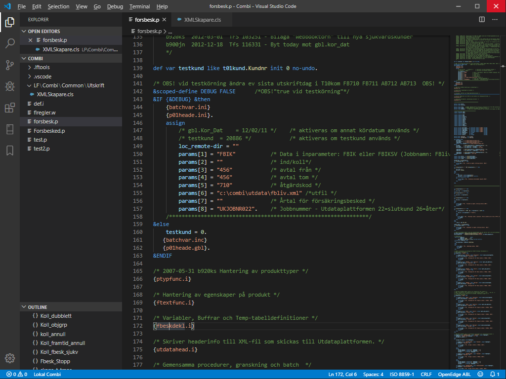
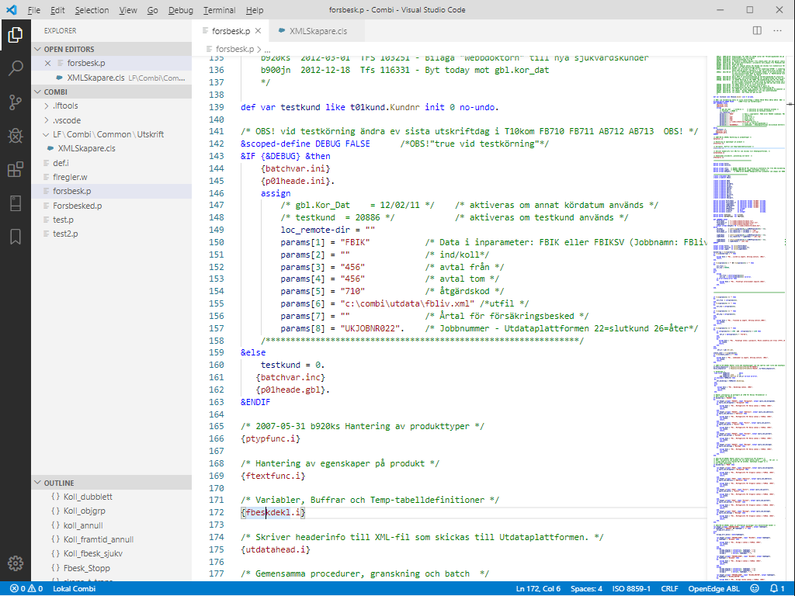
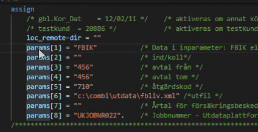
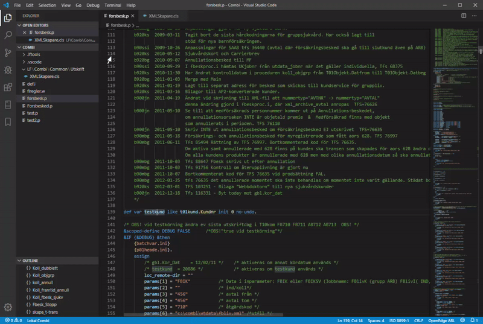
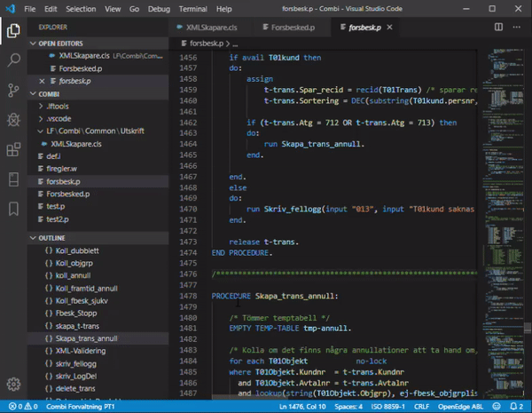
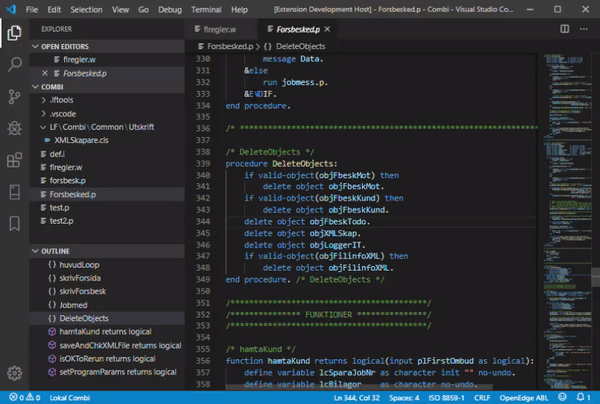
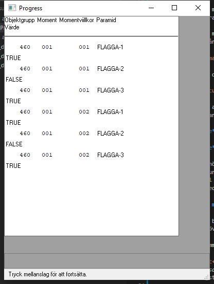
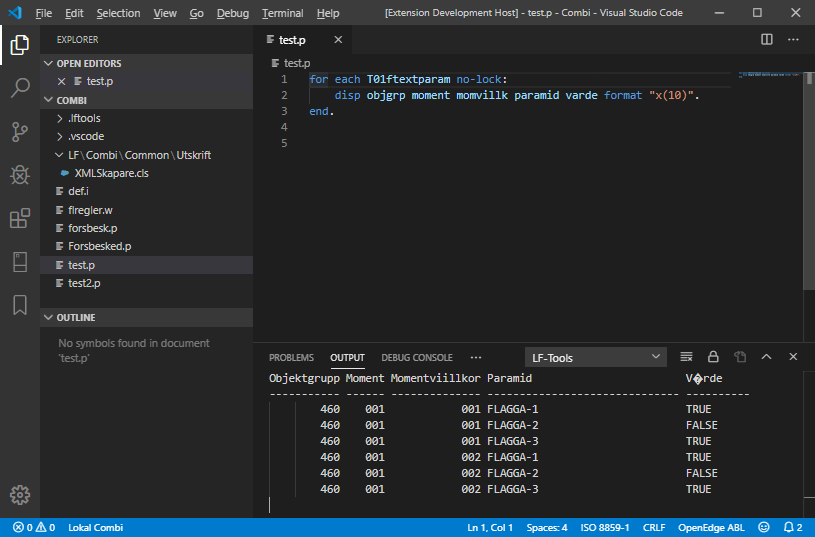
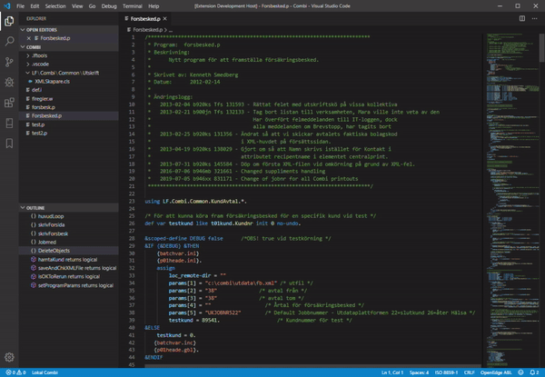
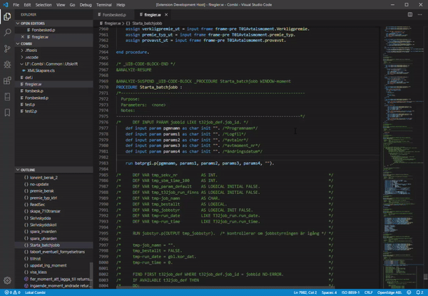

# LF-Tools

LT-Tools är en *extension* till Visual Studio Code med en uppsättning funktioner för att underlätta utveckling av Progress program i Länsförsäkringars miljö. Utvecklingsmiljön har bland annat *IntelliSence*, *Code Outline*, *Syntax highligting*, *Syntax checking* och viss integration med TFS.

## Installation

Ladda ner och installera Visual Studio Code. Installera därefter extension LF-Tools. Alla nedanstående funktioner blir då tillgängliga.

### Arbetskatalog (Workspace folder)

Vilken folder som helst kan göras till en LF-Tools-folder genom att kopiera in följande kataloger och filer i rooten på arbetskatalogen:

```abl
.lftools
    .lftools.config.json
    db.dict.winsure.json
.vscode
    launch.json
    settings.json
```

En grunduppsättning av dessa filer hittar du under **X:\01 System\Combi\LFTools** för Combi och under **X:\01 System\Ture\LFTools** för Ture.
Grundinställningarna pekar ut Combi Förvaltning PT1 för Combi och Ture Förvaltning PT1 för Ture som förvald kompilerings och kör-miljö.

## Features

Nedan följer en beskrivning av utvecklingsmiljöns funktioner.

### Editorn

Utvecklingsmiljön är baserad på Microsoft Visual Studio Code som i sig själv är en kodeditor i världsklass. Den innehåller en hel del riktigt bra funktioner för att skriva kod. Med LF-Tools som tillägg är den ett utmärkt verktyg för att hantera Progresskod i Länsförsäkringars miljö.  Här följer några godbitar av vad *VS Code* i sig har inbyggt.

#### Workspace

Tydlig och översiktlig arbetsyta som man enkelt kan ändra tema på så att det passar en själv.
**Mörkt tema**


**Ljust tema**


Till vänster på arbetsytan visas öppna filer och en lista med alla filer som finns i arbets-foldern. Nere till vänster visas en outline av alla procedurer och funktioner i den nu öppna filen.

Alla öppna filer visas som tabbar över själva arbetsytan. I bilderna ovan ser vi att *forsbesk.p* är öppet och aktivt för redigering och att XMLSkapare.cls är öppen men inte aktiverad.

Till höger på arbetsytan visas en förminskad bild av hela filens innehåll så att man lätt kan se var i filen man just nu redigerar.

#### Bra redigeringkommandon att komma ihåg

* `Alt+Pil Upp` och `Alt+Pil Ner` flyttar raden man står på uppåt eller nedåt
* `Shift+Alt+Pil Upp` och `Shift+Alt+Pil Ner` skapar en kopia av raden man står på ovanför eller under
* `Ctrl+Shift+K` tar bort raden man har sin cursor på
* `Ctrl+K Ctrl+C` Kommentarsmarkerar raden man står på eller alla markerade rader om flera är markerade
* `Ctrl+K Ctrl+U` Tar bort kommentarsmarkering på raden man står på eller alla rader om flera är markerade
* `Ctrl+J` Togglar panelen för *Problems*, *Output*, *Debug consol* och *Terminal*

##### *Multi cursor*-funktioner

* `Ctrl+Shift+L` markerar alla förekomster av ordet man har sin cursor över eller har markerat
* `Ctrl+D` markerar ordet man har sin cursor över. Om ordet redan är markerat så markeras nästa förekomst av ordet

När flera ord är markerade samtidigt och skriver något så ändras alla markerade ord samtidigt. Nedan bild visar när jag trycker **Ctrl+D** ett antal gånger och sedan skriver.



För att läsa mer om alla kommandon i VS Code, gör så här...



VS Code har inte alla kommandon i menyn utan man når dem genom att trycka `Ctrl+Shift+P`. En lista med alla kommandon visas och genom att skriva det man är ute efter filtreras de kommandon man är ute efter fram i listan.

### *IntelliSence*

IntelliSence hjälper till och ger förslag på vad du ska skriver i koden. Exempelvis kan du börja skriva ett tabellnamn så som ```T01```. Då visas en lista med alla tabeller som börjar på T01. Samma gäller även för variabler, procedurer och funktioner, börjar man skriva ett namn så visas en lista med möjliga alternativ. Det här gör att det blir färre stavfel och kodskrivandet går klart snabbare.

Om du är osäker på vad en varaiabel har för datatyp är det bara att ställa muspekaren över variablen så visas datatypen och var den är deklarerad.

Om du behöver veta vad en procedur eller funktion gör, ställ markören på procedur- eller funktions-namnet och klicka `F12` så hoppar du direkt till definitionen av proceduren eller funktionen. Tryck `Alt+Pil vänster` för att hoppa tillbaka till ursprung position igen.

### *Code outline*

I nedre vänstra hörnet av arbetsytan visas en **OUTLINE** av programmet som är aktivt i editorn. För .p och .w program visas procedurer och funktioner. För klasser visas properties, konstruktor och metoder. Genom att klicka en gång på en rad i **OUTLINE** hoppar fokus till symbolen i koden. Dubbelklicka för att även fokusera cursorn till koden. Listan med **OUTLINE** uppdateras löpande när programmet redigeras, men med en viss fördröjning.

### *Integration med Progress OpenEdge*

Integrationen är byggd med hjälp av funktioner i Winenv2 för att hämta paramertar och inställningar för vald miljö. Detta är gjort för att inte behöva installera om och göra nya inställningar när en ny miljö skapas eller flyttas.

Alla Progress-kommandon körs mot en förvald Progressmiljö. Som default är PT1 förvald. Det här betyder att kompilering och kör görs i PT1.
Tryck `Ctrl+Shift+P`och välj kommando **LF-Tools: Select working environment** *(Alla kommandon är på engelska för att VS Code inte klarar av att visa ÅÄÖ i kommandolistan)*. En lista visas då med de miljöer som är tillgängliga. Listan hämtas från Winenv vid start av VS Code. Längst ner i vänstra hörnet på skärmen visas vald miljö.




För att göra det enklare att byta till VS Code från Progress-editorn finns de två mest använda kommandona med även i LF-Tools, `F2` för att köra program och `Shift+F2` för att kontrollera syntax (kompilera).

#### Kontrollera syntax (kompilera)

När ett program sparas körs en syntax check mot vald miljö. Resultatet syns i nedre vänstra hörnet, bredvid namnet på den valda miljön. Om fel uppstår markeras raden med felet. Kontroll av syntax görs vid spara eller när man trycker `Shift+F2`.



#### Kör program

Det finns två sätt att köra program, antingen med `F2` där eventuellt resultat visas i ett Progress-fönster eller genom att trycka `Alt+F2` för att visa resultatet direkt i VS Code. **Observera att den senast sparade koden är den som körs. Det betyder att du måste spara innan du kör.** Detta är en skillnad från att köra direkt i Procedure editor. 

Propath kommer alltid peka på den aktuella arbetskatalogen plus den ordinarie propathen för vald miljö. Det här gör att man inte längre är beroende av att alltid utveckla program i C:\Combi för Combi och C:\TureUtv för Ture. Det går att skapa många olika arbetskataloger.

Nedan beskriver hur resultatet visas beroende på hur man kör. Följande kod har använts som exempel:

```abl
for each T01ftextparam no-lock:
    disp objgrp moment momvillk paramid varde format "x(10)".
end.
```

##### Kör via F2

Det aktuella programmet måste vara sparat annars kommer det senast sparade versionen att köras. Tryck sedan `F2` så körs programmet i den valda miljön. Resultatet visas på det här sättet.



##### Kör via Alt+F2

Genom att köra med `Alt+F2` visas resultat direkt i VS Code. Det kan vara bra i de fall men vill kopiera något värde ur resultatet av utsökningen. VS Code stöder tyvärr inte ÅÄÖ i resultatet så dessa visas som konstiga tecken som bilden nedan visar.



Om du inte vill fortsätta visa Output-panelen är det bara att trycka `Ctrl+J` för att stänga den.

#### Öppna i Progress-editor

Ibland vill man kanske öppna det program man jobbar med i Progress-editorn istället för i VS Code. Det kan man göra genom att spara koden och sedan trycka `F3`. Programmet öppnas då i Progress-editorn och propath är satt till arbetskatalogen plus den ordinarie propathen för vald miljö.

#### Start en Combi- eller Ture-miljö

Klicka på `Ctrl+Alt+P` för att få upp en lista över valbara miljöer. Miljön startas med propath till den aktuella arbetskatalogen plus den ordinarie propathen för vald miljö.

### Integration med TFS

Integrationen med TFS innehåller än så länge bara två funktioner, jämför program och öppna program.

#### Jämför program

Ibland när man gjort större ändringar i ett program vill man kontrollera skillnaden mot den tidigare versionen för att se att man inte ändrat något man inte borde ha ändrat. Det här är väldigt enkelt i VS Code med LF-Tools.

Ha det aktuella progammet öppet och sparat i VS Code och tryck bara `Ctrl+Alt+C` så visas ett diff-fönster. Alternativt kan man trycka `Ctrl+Shift+P` och sedan välja funktionen **LF-Tools: Compare current file with file in source control**.



#### Öppna program

Om man, som i exemplet nedan, är intresserad av vad programmet ```batprgi.p``` gör kan man ställa markören på progamnamnet och trycka `Ctrl+Alt+O`. Programmet öppnas då från TFS-katalogen i en egen flik. Man behöver med andra ord inte markera hela programmet, även om det också fungerar.



## Inställningar

Inställningar för LF-Tools är lagrade i filen .lftools.config.json som ligger under .lftools i arbetskatalogen.
Filen innehåller inställningar för den aktiulla arbetskatalogen och kan ändras om så önskas.

Så här ser filen ut:

```json
{
    "systemId": "Combi",
    "workingDirectory": "${workspaceFolder}",
    "dlc": "C:\\Progress\\OpenEdge",
    "serverFilterPrefix": "e75lc",
    "progressVersion": "11.7",
    "useLocalDB": false,
    "syntaxCheckMode": "serverenv",
    "usePickListOnStartEnv": true,
    "checkSyntaxOnSave": true,
    "propathMode": "append",
    "propath": [
        "${workspaceFolder}"
    ],
    "we2ServiceProgram": "we2VSCode.p",
    "we2PfFile": "\\\\e75lc0024\\client\\winenv2\\swedish.pf",
    "we2Propath": [
        "\\\\e75lc0024\\client\\winenv2\\sure_r",
        "\\\\e75lc0024\\client\\winenv2"
    ],
    "sourceControlFolder": "C:\\CombiTfs\\src",
    "paramsInOutline": false,
    "includesInOutline": false,
    "selectedEnvId": 999,
    "localDBConfig": {
        "localEnvId": 999,
        "localEnvName": "Lokal Combi",
        "localEnvPfFile": "C:\\LokEnv\\Combi\\winsure\\cwinsure.pf",
        "localEnvIniFile": "C:\\LokEnv\\Combi\\winsure\\proini_vscode.ini",
        "localEnvPropath": [
            "C:\\LokEnv\\Combi\\server\\sure_rb",
            "C:\\LokEnv\\Combi\\server\\sure_src",
            "C:\\LokEnv\\Combi\\client\\sure_r",
            "C:\\LokEnv\\Combi\\client\\sure_src"
        ]
    },
    "debugLogging": false,
    "formatting": {
      "updateCaseOnFormat": true,
      "useUpperCase": true,
      "updateIndent": true,
      "updateStatements": true
    }
}
```

## Kommande funktioner och förbättringar

* Automatisk formatering
* Möjlighet att debugga Progresskod direkt i VS Code
* Utökad integration med TFS, se versionshistorik, öppna ärende direkt från VSCode, mm.
* Förbättringar av IntelliSence, få upp lista med methoder i en klass, mm.

## Kända fel

För tillfället finns det inga kända fel.

## Release Notes

### 0.1.0

Första releasen av LF-Tools extension för VS Code.
